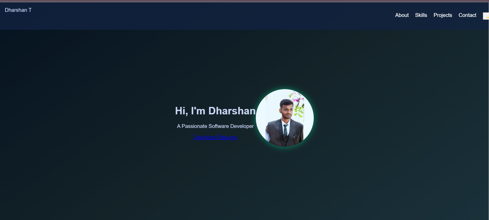

# 🚀 Dharshan's Portfolio  

🌟 Welcome to my **personal portfolio website**, where I showcase my **skills, projects, and experience**.  

### 🔥 **Live Website:**  
👉 **[View Portfolio](https://Dharshan1309.github.io/Portfolio/)**  

---

## 🎨 **Features**
✅ **Modern UI with Glassmorphism & Floating Hero Section**  
✅ **Advanced Gradient Backgrounds for a Futuristic Look**  
✅ **Smooth Typing Animation in the Hero Section**  
✅ **Project Showcases with Hover Effects**  
✅ **Direct Contact Links to Email & LinkedIn**  
✅ **Mobile-Responsive & Fully Optimized**  

---

## 📸 **Screenshot Preview**
*(Optional: Add a screenshot of your portfolio)*  
1. **Take a screenshot of your portfolio.**  
2. **Save it inside the `assets/` folder** and name it **`screenshot.png`**.  
3. **Update the code below** to include the screenshot:  

```md

```

---

## 🛠 **Tech Stack**
- **Frontend:** HTML5, CSS3, JavaScript  
- **Animations:** CSS Keyframes, JavaScript  
- **Deployment:** GitHub Pages  

---

## 📂 **Folder Structure**
```
portfolio/
│── index.html         # Main Portfolio Page  
│── style.css          # Advanced Styling  
│── script.js          # JavaScript for Animations & Interactions  
│── assets/  
│   ├── profile.jpg    # Profile Picture  
│   ├── resume.pdf     # Resume Download  
│   ├── screenshot.png # (Add a screenshot of the portfolio)  
│── README.md          # Project Documentation  
```

---

## 🚀 **How to Use**
1. **Clone this repository:**  
   ```sh
   git clone https://github.com/Dharshan1309/Portfolio.git
   ```
2. **Open `index.html` in a browser**.  

---

## 🌍 **Deploying on GitHub Pages**
This portfolio is deployed using **GitHub Pages**.  
To deploy:  
1. **Go to GitHub → Repository → Settings → Pages**  
2. **Select the `main` branch and save**  
3. **Your site will be live at:**  
   ```
   https://Dharshan1309.github.io/Portfolio/
   ```

---

## 📩 **Contact Me**
📧 **Email:** [dharshan.talapaneni@gmail.com](mailto:dharshan.talapaneni@gmail.com)  
🔗 **LinkedIn:** [linkedin.com/in/dharshan-t-1bb982231](https://www.linkedin.com/in/dharshan-t-1bb982231)  

---

## ⭐ **Support & Contributions**
If you like my portfolio, please **⭐ star this repository** and share your feedback!  
